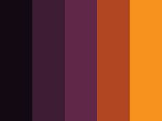
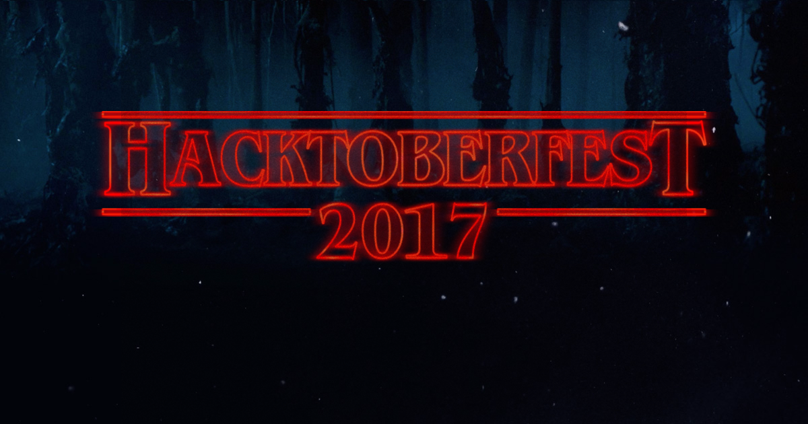

# Hacktoberfest Website Redesign

Table of Contents
-----------------

- [About The Website](#about-the-website)
- [New Design Details](#new-design-details)
    - [Palette](#palette)
    - [Hero Image](#hero-image)
    - [T-shirt, Sticker, Site Design](#t-shirt-sticker-site-design)
    - [Font Pairing](#font-pairing)
- [Resources Used for Redesign](#resources-used-for-redesign)
- [Old Website Design](#old-website-design)

## About the Website

[Single Page Application](https://en.wikipedia.org/wiki/Single-page_application), made using [Golang](https://golang.org), deployed via [Docker](https://www.docker.com) and [Heroku](https://www.heroku.com)

National Initiative
* [Hacktoberfest](https://hacktoberfest.digitalocean.com)

devICT Hacktoberfest Website and GitHub
* [devICT Hacktoberfest](https://devict-hacktoberfest.herokuapp.com)
* [devICT Hacktoberfest GitHub](https://github.com/devict/hacktoberfest)

Local Server
* [Local Server](http://localhost:8080)

:top: [**back to top**](#table-of-contents)

## New Design Details

This is one of several possible designs. 

### Palette

:top: [**back to top**](#table-of-contents)

### Hero Image

The main image was used with permission from [Kim Støvring](https://www.flickr.com/photos/kimstovring/15486932228/in/dateposted) under [CC License](https://creativecommons.org/licenses/by/2.0). A silhouette of a female was cropped into the house window. This image was used with permission from [pixabay](https://pixabay.com/p-949058) under [CC License](https://creativecommons.org/publicdomain/zero/1.0/deed.en).

:top: [**back to top**](#table-of-contents)

<!--
Hero (Used with permission from [Nick Quaranto](http://quaran.to/blog/2008/10/20/pumpkin-carving-2008) under [CC License](https://creativecommons.org/licenses/by-sa/3.0/us))

Other possibilities: Quirky, Fun, Quaint, Sophisticated
-->

### T-shirt, Sticker, Site Design

@kentonh (Kenton Hansen) has suggested this as a possible t-shirt/sticker/site design

### Font Pairing

Main: [Nosifer](https://fonts.google.com/specimen/Nosifer)

Pairing

:top: [**back to top**](#table-of-contents)

### Layout Mockups

:top: [**back to top**](#table-of-contents)

## Resources Used for Redesign

Design
* [Style Tiles](http://styletil.es)
* Design Sprint

<!--
http://www.gv.com/sprint
https://designsprintkit.withgoogle.com
https://developers.google.com/design-sprint
https://github.com/thoughtbot/design-sprint
https://en.wikipedia.org/wiki/Design_sprint
-->

Protyping
* [Keynotopia](http://keynotopia.com)

Full Page Screen Shots
* [Open Screenshot](https://chrome.google.com/webstore/detail/open-screenshot/akgpcdalpfphjmfifkmfbpdmgdmeeaeo/related?hl=en)

Code Editor: Brackets (a.k.a. Edge Code)
* [Brackets](http://brackets.io)

Layout
* [Multi-Device Layout Patterns](http://www.lukew.com/ff/entry.asp?1514)

Semantics
* [Semantic HTML](https://en.wikipedia.org/wiki/Semantic_HTML)

Semantic Site Audit

Document Outline
* [HTML Outline](https://developer.mozilla.org/en-US/docs/Web/Guide/HTML/Using_HTML_sections_and_outlines) (HTML5 versus HTML4)

<!--
HTML5 Outliner
https://chrome.google.com/webstore/detail/html5-outliner/afoibpobokebhgfnknfndkgemglggomo?hl=en
https://addons.mozilla.org/en-US/firefox/addon/html5_outliner/
-->

Hosted Libraries
* [Google Libraries](https://developers.google.com/speed/libraries)

Fonts
* [Google Fonts](https://fonts.google.com)

Typographic Scale and Vertical Rhythm
* [Modular Scale](http://www.modularscale.com)
* [Vertical Rhythm](https://drewish.com/tools/vertical-rhythm)

Photo Editing
* [Gimp](http://www.gimp.org)

CSS Reset (HTML5 Compatibility Check/Normalization)
* [Normalize GitHub](https://github.com/necolas/normalize.css)  

Mozilla HTML5 and CSS3- Info and Tutorials
* [Mozilla HTML5](https://developer.mozilla.org/en-US/docs/Web/Guide/HTML/HTML5)
* [Mozilla CSS3](https://developer.mozilla.org/en-US/docs/Web/CSS/CSS3)

Mozilla HTML and CSS Tutorials
* [Mozilla HTML](https://developer.mozilla.org/en-US/docs/Web/HTML)
* [Mozilla CSS](https://developer.mozilla.org/en-US/docs/Web/CSS)

HTML5 and CSS3 Cheat Sheets
* [HTML5- The Web platform: Browser technologies](https://platform.html5.org)
* [HTML5 Please](http://html5please.com)
* [Can I Use](http://caniuse.com) and [Can I Use GitHub](https://github.com/Fyrd/caniuse)

WHATWG (Better Reference than W3C)
* [WHATWG (Web Hypertext Application Technology Working Group)](https://whatwg.org), [WHATWG Developers](https://developers.whatwg.org)

W3C (The World Wide Web Consortium) Standards
* [W3C HTML](https://www.w3.org/html)
* [W3C HTML4 Elements](https://www.w3.org/TR/html4/index/elements.html)
* [W3C HTML5](https://www.w3.org/TR/html5)
* [W3C Developer Tools](http://w3c.github.io/developers/tools)

Responsiveness- and Media Queries
* [Mozilla Developer Media Queries](https://developer.mozilla.org/en-US/docs/Web/Guide/CSS/Media_queries) and [Mozilla Developer Using Media Queries](https://developer.mozilla.org/en-US/docs/Web/CSS/Media_Queries/Using_media_queries)
* [Google Developers Responsive Fundamentals- Use of Media Queries](https://developers.google.com/web/fundamentals/design-and-ui/responsive/fundamentals/use-media-queries?hl=en)
* [Google Developers Responsive Fundamentals- How to Choose Breakpoints](https://developers.google.com/web/fundamentals/design-and-ui/responsive/fundamentals/how-to-choose-breakpoints?hl=en)

<!--
https://developers.google.com/web/fundamentals/design-and-ui/responsive/patterns
-->

Google 
* [Google Web Fundamentals](https://developers.google.com/web/fundamentals), [Google Web Fundamentals: GitHub](https://github.com/google/WebFundamentals), and [Google Web Fundamentals Research Study](https://developers.google.com/web/fundamentals/principles/research-study)  

jQuery
* [jQuery](https://jquery.com) (version impacts browser support)

HTML and CSS Styleguides
* [GitHub CSS Styleguide](http://primercss.io) 
* [MDO Code Guide](http://codeguide.co) and [MDO Code Guide GitHub](https://github.com/mdo/code-guide) 
* [Google HTML and CSS Styleguide](https://google.github.io/styleguide/htmlcssguide.html)

Accessibility
* [WebAim](http://webaim.org)

Validation
* [W3C Nu HTML Validator](https://validator.w3.org/nu)
* Do Cross Browser Testing

Lints
* [CSS LINT](http://csslint.net)

Google Developers- General and Web
* [Google Developers](https://developers.google.com) 
* [Google Developer Web](https://developers.google.com/web)

Google Developers- Google Chrome Doc
* [Google Chrome Home](https://developers.google.com/chrome)
* [Google Chrome DevTool Docs](https://developers.google.com/web/tools/chrome-devtools)
* [Google Chrome DevTools (Old)](https://developer.chrome.com/devtools)

Browser Statistics

Graph and Schema- General (See also Facebook Open Graph and W3C Semantic Extractor)
* [Open Graph Protocol Schema](http://ogp.me) 
* [Schema Org](http://schema.org)
* [Schema Creator](http://schema-creator.org)

Microformats
* [Microformats](http://microformats.org)

<!--
* [Eric A. Meyer CSS Reset](http://meyerweb.com/eric/tools/css/reset)

* [Modernizr](http://modernizr.com) and [Modernizr GitHub](https://github.com/Modernizr/Modernizr)  

https://modernizr.com/download?setclasses

* [Google JavaScript Styleguide](https://google.github.io/styleguide/javascriptguide.xml)

JavaScript Styleguide  
* [Airbnb JavaScript Styleguide GitHub](https://github.com/airbnb/javascript) 

* [Bootstrap Lint GitHub](https://github.com/twbs/bootlint)
* [Sass Lint](https://www.npmjs.com/package/sass-lint)

Microsoft Developer Tools
* [Microsoft Edge Developer Documentation](https://github.com/MicrosoftDocs/edge-developer)
* ["Meet the Microsoft Edge F12 Dev Tools"](https://docs.microsoft.com/en-us/microsoft-edge/f12-devtools-guide)
* [F12 Developer Tool Keyboard Shortcuts](https://msdn.microsoft.com/en-us/library/dn322041(v=vs.85).aspx)

Safari Developer Tools
* [Safari Web Inspector](https://developer.apple.com/library/safari/documentation/AppleApplications/Conceptual/Safari_Developer_Guide/Introduction/Introduction.html)

Mozilla Developer Tools
* [Firefox Developer Tools](https://developer.mozilla.org/en-US/docs/Tools) and [Firebug](http://getfirebug.com)
* [Firebug Chrome](http://getfirebug.com/releases/lite/chrome) and [Firebug Chrome Store](https://chrome.google.com/webstore/detail/firebug-lite-for-google-c/bmagokdooijbeehmkpknfglimnifench)

* Document Flow

* Selector Grouping
* [Cascade](https://developer.mozilla.org/en-US/docs/Web/CSS/Cascade)

Adobe (See also Edge Code and Brackets)
* [Adobe Creative Cloud](http://www.adobe.com/creativecloud) and [Adobe Creative Cloud Blog](https://blogs.adobe.com/creativecloud)
* [Adobe Edge Web Fonts](https://edgewebfonts.adobe.com)

https://github.com/adobe-fonts

https://creative.adobe.com/plans

https://blog.typekit.com/2017/05/02/hundreds-more-fonts-in-the-library-and-marketplace-1500-added-for-sync/
https://typekit.com/fonts
https://helpx.adobe.com/typekit/system-subscription-requirements.html
http://www.adobe.com/creativecloud/catalog/desktop.html
http://www.adobe.com/creativecloud/desktop-app.html

* [Mood Board Wikipedia](https://en.wikipedia.org/wiki/Mood_board)

Progressive Enhancement
* [Progressive Enhancement Wikipedia](https://en.wikipedia.org/wiki/Progressive_enhancement)

Responsive Design/Patterns

Device Mockups and Specifications

* [MaxCDN Bootstrap](http://maxcdn.bootstrapcdn.com/bootstrap/3.2.0/css/bootstrap.min.css)

Font Stack
* [Web Safe Fonts](https://en.wikipedia.org/wiki/Web_typography#Web-safe_fonts)
* [Fallback Font Wikipedia](https://en.wikipedia.org/wiki/Fallback_font)

Typical base is 16px
https://medium.freecodecamp.com/how-to-choose-and-pair-typefaces-98fee945d13c#.c9d6lv6lj

Em
-->
<!--
http://jonibologna.com/flexbox-cheatsheet
http://jonibologna.com/content/images/flexboxsheet.pdf
-->

<!--
Mozilla JavaScript Tutorials
* [Mozilla JavaScript](https://developer.mozilla.org/en-US/docs/Web/JavaScript)  
* [Mozilla JavaScript Guide](https://developer.mozilla.org/en-US/docs/Web/JavaScript/Guide) 
* [Mozilla JavaScript Reference](https://developer.mozilla.org/en-US/docs/Web/JavaScript/Reference)  
* [Mozilla Web API](https://developer.mozilla.org/en-US/docs/Web/API)
* [A Re-introduction to JS](https://developer.mozilla.org/en-US/docs/Web/JavaScript/A_re-introduction_to_JavaScript)

* [Mozilla Document Object Model Reference](https://developer.mozilla.org/en-US/docs/Web/API/Document_Object_Model)
-->

<!--
Speed and Performance
* [Google GWT (including Speedtracer)](http://www.gwtproject.org)
* [Google PageSpeed (Score of 90+)](https://developers.google.com/speed/pagespeed)
* [Netflix Fast](https://fast.com)
* [Yahoo YSlow score of 85+](http://yslow.org)

https://www.webpagetest.org/
https://github.com/WPO-Foundation/webpagetest

W3 Validators
* [W3C HTML Validator](http://validator.w3.org)
* [W3C CSS Validator](http://jigsaw.w3.org/css-validator)
* [W3C Semantic Extractor](http://www.w3.org/2003/12/semantic-extractor.html)
* [W3C Link Checker](https://validator.w3.org/checklink)
<!--* [iWebTool Broken Link Checker](http://iwebtool.com/broken_link_checker)-->
<!--* [W3C Mobile Validator](http://validator.w3.org/mobile)
* [W3C i18n Checker](http://validator.w3.org/i18n-checker)

Accessibility
* [WebAIM Checklist](http://webaim.org/resources/evalquickref/#checklist)
* [WebAIM Contrast Checker](http://webaim.org/resources/contrastchecker)
* [Check My Colours (Color Contrast)](http://www.checkmycolours.com)
* [IDI Web Accessibility Checker](http://achecker.ca/checker/index.php) 
* [NV Access (Test Using a Screen Reader)](http://www.nvaccess.org)

Microsoft Inclusion Approach
* [Microsoft Inclusive Toolkit Manual and Activities](https://www.microsoft.com/en-us/Design/inclusive)

<!--
https://blogs.msdn.microsoft.com/accessibility/2017/03/01/a-look-back-and-a-look-ahead-at-accessibility-at-microsoft/

https://ft-interactive.github.io/accessibility
https://accessibility.blog.gov.uk/2016/09/02/dos-and-donts-on-designing-for-accessibility

https://en.wikipedia.org/wiki/Assistive_technology
https://en.wikipedia.org/wiki/Web_Content_Accessibility_Guidelines
https://www.ada.gov

https://en.wikipedia.org/wiki/Screen_reader
http://www.freedomscientific.com/Products/Blindness/JAWS
http://webaim.org/techniques/screenreader/
Screen Reader Outline
http://www.chromevox.com/
https://en.wikipedia.org/wiki/WAI-ARIA

http://quirksmode.org/css/contents.html
https://en.wikibooks.org/wiki/Internet_Explorer/Adding_User_Styles
http://www.iecss.com/

https://developer.mozilla.org/en-US/docs/Learn/Tools_and_testing/Cross_browser_testing

Accessibility in Internet Explorer 11
https://www.microsoft.com/enable/products/ie11/
https://en.wikipedia.org/wiki/Internet_Explorer_8

Compat Inspector
http://ie.microsoft.com/testdrive/HTML5
modern.IE
http://www.modern.ie/report

https://developer.microsoft.com/en-us/microsoft-edge
https://developer.microsoft.com/en-us/microsoft-edge/testdrive/demos/compatinspector
https://developer.microsoft.com/en-us/microsoft-edge/tools/staticscan

Photosensitive Epilepsy
* [Photosensitive Epilepsy Wikipedia](https://en.wikipedia.org/wiki/Photosensitive_epilepsy)

seizure disorders, migraines, or ADD/ADHD
https://www.epilepsy.org.uk/info/photosensitive-epilepsy/web-design
http://webaim.org/articles/seizure/
https://www.w3.org/TR/UNDERSTANDING-WCAG20/seizure.html
-->

:top: [**back to top**](#table-of-contents)

## Old Website Design

:top: [**back to top**](#table-of-contents)
