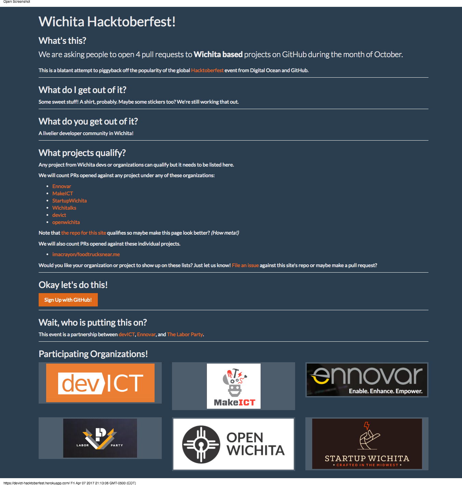
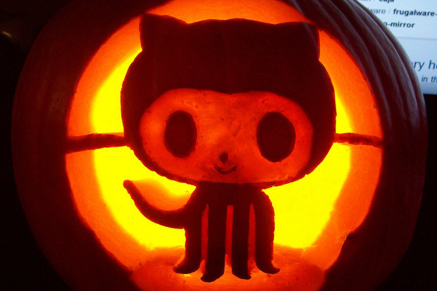

# Hacktoberfest Website Redesign

* [devICT Hacktoberfest](https://devict-hacktoberfest.herokuapp.com)
* [devICT Hacktoberfest GitHub](https://github.com/devict/hacktoberfest)
* [Local Server](http://localhost:8080)

## Website As Is

[Single Page Application](https://en.wikipedia.org/wiki/Single-page_application), made using [Golang](https://golang.org), deployed via [Docker](https://www.docker.com) and [Heroku](https://www.heroku.com)

## Example Designs

### Example 1: Fun

Hero (Used with permission from [Nick Quaranto](http://quaran.to/blog/2008/10/20/pumpkin-carving-2008) under [CC License](https://creativecommons.org/licenses/by-sa/3.0/us))

### Example 2: Sophisticated
